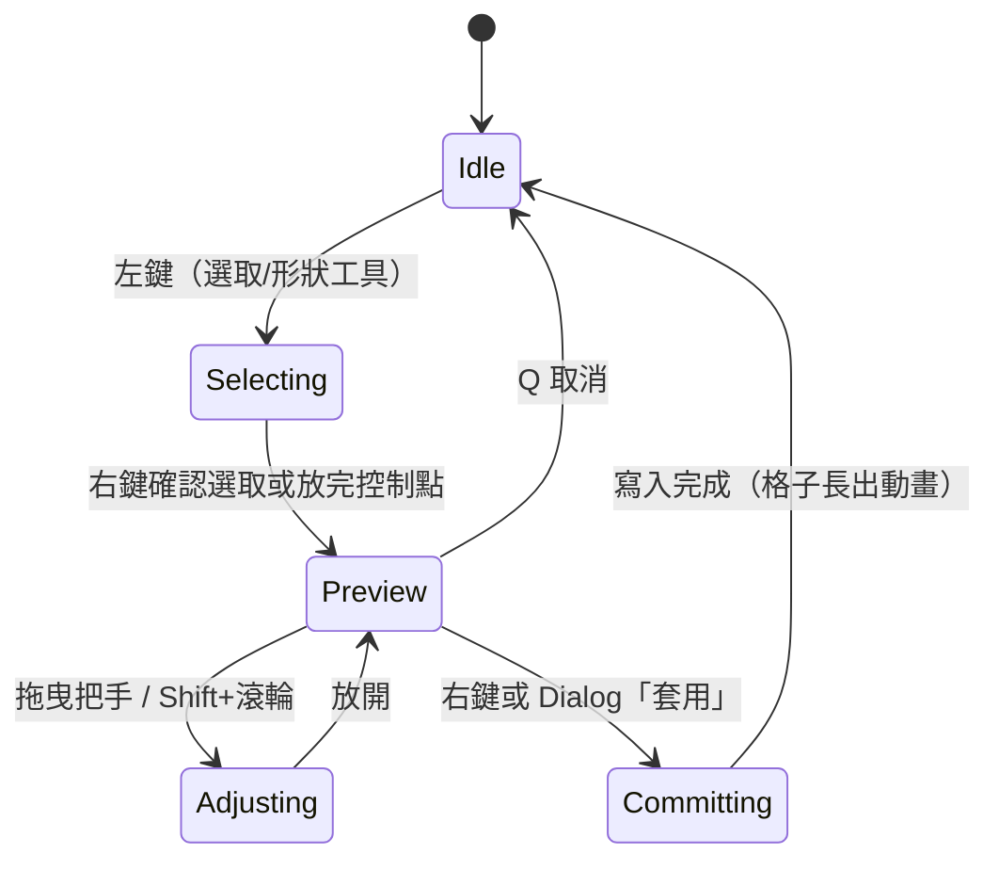
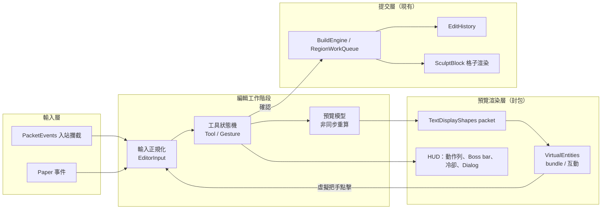

# Sculpt 操作重新設計研究報告

> 狀態：研究提案，未實作。本文允許完全打破現有指令、按鍵與工具用法。
> 基準：`main` @ `22db06d`（已含建築工具組 PR #2）。
> 研究日期：2026-09-28。

## 目錄

1. [摘要](#1-摘要)
2. [研究範圍與方法](#2-研究範圍與方法)
3. [現況盤點](#3-現況盤點)
4. [技術能力研究](#4-技術能力研究)
5. [設計原則](#5-設計原則)
6. [新操作模型](#6-新操作模型)
7. [視覺語言與動畫系統](#7-視覺語言與動畫系統)
8. [系統架構](#8-系統架構)
9. [相容性、風險與取捨](#9-相容性風險與取捨)
10. [上游函式庫需要補強的地方](#10-上游函式庫需要補強的地方)
11. [分階段路線圖](#11-分階段路線圖)
12. [驗證計畫](#12-驗證計畫)
13. [待決策問題](#13-待決策問題)
14. [附錄](#14-附錄)

---

## 1. 摘要

Sculpt 的核心資料模型（每個方塊一棵 16³ 八元樹）已經相當成熟，但**操作層是逐步疊加出來的**：17 個主指令、4 種外觀與點擊語意各不相同的工具物品、藏在 `F`/`Q`/雙擊/`Shift+Q` 裡的模式切換，以及「按下就直接寫入世界」的破壞性流程。玩家必須記住很多東西，而且幾乎看不到操作的結果會是什麼。

本報告建議把 Sculpt 重新設計成**一個有明確進入與離開的「編輯器」**：

| 面向 | 現在 | 建議 |
| --- | --- | --- |
| 進入方式 | `/sculpt mode on`，之後普通點擊就會雕刻 | 一個「雕刻刀」物品或 `/sculpt`，進入**編輯模式**後快捷列變成工具盤（封包層，不動真實背包） |
| 工具 | 選取魔杖、藍圖選取器、建築工具、筆刷四種物品 | 單一編輯模式內的 9 個工具槽：雕刻、筆刷、選取、變形、形狀、上色、藍圖、測量、設定 |
| 參數 | 大多靠指令（`/sculpt resolution 4`、`/sculpt brush size 3`） | 滾輪切工具、`Shift`+滾輪調大小、`F` 切解析度、Paper Dialog 表單調細項 |
| 預覽 | 玻璃 ItemDisplay 與粒子 | TextDisplayShapes 線框與半透明面，只給操作者看，並以插值平滑跟隨游標 |
| 破壞性操作 | 下指令即寫入 | 一律「選取 → 預覽 → 調整 → 確認」，確認前完全不動世界 |
| 動畫 | 無 | 格子長出、縮回、變形移動、復原倒帶都有插值動畫 |
| 選取 | 方塊級長方體與藍圖的單方塊/長方體兩套系統 | 統一的**格子級**選取（框選、連通選取、材質選取、加減選） |

技術上，Paper 1.21.11 已經提供大部分**觀察型**輸入事件（`PlayerInputEvent`、`PlayerPickBlockEvent`、Dialog 與 `PlayerCustomClickEvent`），而**需要攔截、偽造或只給單一玩家看**的部分由 PacketEvents 2.14.0 補足：虛擬快捷列、虛擬可點擊把手、每位玩家獨立的發光與預覽、原子化的封包 bundle。所有預覽物件都走 TextDisplayShapes 的封包模組與 VirtualEntities，不產生伺服器實體。

建議分四階段推進（第 11 節），第一階段只重做輸入與預覽，不動資料模型；把格子本身改成封包渲染是最後、也最可選的一步，因為目前的持久化直接存在實體 PDC 裡（「實體即資料庫」）。

---

## 2. 研究範圍與方法

**閱讀的程式碼**

- Sculpt `main`：`editor/*`（點擊、懸浮、選取、控制鍵）、`building/*`、`blueprint/*`、`plugin/*Command`、`render/text/*`、`transport/*`、`Sculpt.java`。
- [TWME-TW/TextDisplayShapes](https://github.com/TWME-TW/TextDisplayShapes) 3.0.1：`api`、`paper`、`packet` 三個模組。
- [twme-ai/VirtualEntities](https://github.com/twme-ai/VirtualEntities) `main`：viewer 生命週期、metadata、bundle、互動轉送。
- [retrooper/packetevents](https://github.com/retrooper/packetevents) v2.14.0（2026-09-23）：`wrapper/play/client` 與 `wrapper/play/server`。
- 先前的內部文件：`Sculpt-command-redesign/ReDesign.md`、`SculptMode-規格書.md`、`Sculpt-research/研究報告.md`。

**查證方式**

- Paper API 事件是否存在、能否取消：直接對 `paper-api-1.21.11` jar 執行 `javap`。
- 協定封包是否存在：以 `minecraft-data` 的 1.21.11 協定表與 PacketEvents 原始碼樹比對。
- 使用體驗問題：以程式碼路徑與 README 的操作說明推導；PR #2 在真實 Paper 1.21.11 上的端對端測試也提供了一些觀察（見 9.4）。

**可信度標記**：本文的技術主張分成三級。

- ✅ 已查證：直接在 jar、原始碼或協定表中確認。
- 🔶 高度可信：依原版行為推論，實作前需用小型 spike 驗證。
- ❓ 未知：需要實驗才知道。

---

## 3. 現況盤點

### 3.1 輸入對照（現況）

| 輸入 | 前提 | 行為 |
| --- | --- | --- |
| 左鍵 | Sculpt 模式開啟 | 移除格子；一般方塊會先轉成 SculptBlock |
| 右鍵 | Sculpt 模式開啟 | 以主手方塊放置格子；在邊緣延伸到隔壁方塊 |
| `F` | Sculpt 模式開啟 | 循環解析度 1→2→4→8→16 |
| `Q` | Sculpt 模式開啟 | 單擊循環填充模式（等待 300 ms 雙擊視窗） |
| `Q`×2 | Sculpt 模式開啟 | 循環顯示模式 |
| `Shift`+`Q` | Sculpt 模式開啟 | 暫停/恢復 |
| 左/右鍵 | 手持骨頭（選取魔杖） | 設定角落 1/2 |
| `F` | 手持選取魔杖 | 清除選取 |
| 左/右鍵 | 手持藍圖選取器 | 選取/貼上，或長方體角落 |
| `F` / `F`×2 | 手持藍圖選取器 | 取消 / 切換單方塊與長方體 |
| 右鍵 | 手持綁定藍圖的物品 | 貼上 |
| 左/右鍵（`Shift`） | 手持建築工具（烈焰桿） | 移除/新增控制點 |
| 左/右鍵 | 手持雕刻筆刷 | 依筆刷模式挖除/堆加/平滑/上色/吸色 |

**主指令 17 個**：`help resolution preview mode fill display convert replace relight build brush undo redo tool blueprint heads admin`，其中 `blueprint` 下還有 14 個子指令。

### 3.2 主要問題

1. **模式是隱形的。** Sculpt 模式一開，普通左鍵就會破壞方塊，只有動作列的一句話提示。`F`、`Q` 被挪用，關閉後又恢復原版行為，玩家很難建立穩定的肌肉記憶。
2. **雙擊造成延遲。** `Q` 與藍圖選取器的 `F` 為了分辨雙擊，單擊動作要延後 300 ms 才生效（`controls.doubleTapWindowMs`）。
3. **四種工具，四套語意。** 同樣是左鍵：魔杖是「角落 1」、藍圖選取器是「選這個方塊」、建築工具是「刪上一個點」、筆刷是「挖除」。`F` 在三種工具上又各自代表不同的事。
4. **參數靠指令。** 調解析度、筆刷大小、厚度、填充、顯示都要打字或背快捷鍵；可用範圍只能靠 tab 補全發現。
5. **看不到後果。** 懸浮預覽是玻璃 ItemDisplay；`/sculpt build`、`/sculpt replace`、藍圖貼上都是按下就寫入，只能事後 `/sculpt undo`。
6. **材質來源互相衝突。** 放置材質來自主手，但主手又必須拿工具，所以建築工具組只好改用副手。這是模型問題，不是個別工具的問題。
7. **兩套選取。** 方塊級長方體選取（魔杖）與藍圖選取器各自維護狀態，而且都無法選到「格子」。PR #2 的控制點又是第三套。
8. **回饋管道分散**：聊天、動作列、粒子、玻璃展示實體、聲音都有，但沒有一致的語言（例如顏色代表什麼）。
9. **所有視覺元素都是伺服器實體。** 預覽高亮、格子頭顱、TextDisplay 像素、Interaction、Shulker 都是真實實體，會被每位玩家追蹤、占用實體預算，也讓只給操作者看的預覽變得很昂貴。

### 3.3 值得保留的部分

- 八元樹資料模型、canonical 化與 `BuildEngine` 的「離線樹編輯 → 一次替換」寫入流程。
- `RegionWorkQueue` 的 Folia 安全分批寫入、區域保護檢查、SculptBlock 上限。
- 復原/重做的快照與「被別人改過就跳過」的語意。
- 以玩家解析度為單位的格子網格概念，以及穿透空洞的 DDA 游標追蹤（`HoverEngine`）。

---

## 4. 技術能力研究

### 4.1 Paper 1.21.11 原生能力（✅ 已查證）

| API | 用途 | 可取消 | 備註 |
| --- | --- | --- | --- |
| `PlayerInputEvent` + `org.bukkit.Input` | WASD、跳躍、潛行、衝刺的按下狀態 | 否 | 只能觀察；玩家仍然會移動 |
| `PlayerItemHeldEvent` | 滾輪與數字鍵切換快捷列 | 是 | 可用來把滾輪當成數值輸入 |
| `PlayerSwapHandItemsEvent` / `PlayerDropItemEvent` | `F` / `Q` | 是 | 現況已在使用 |
| `PlayerPickBlockEvent` / `PlayerPickEntityEvent` | 滑鼠中鍵（1.21.4+ 由伺服器處理） | 是 | 適合當作「吸色」 |
| `io.papermc.paper.dialog.Dialog` + `PlayerCustomClickEvent` | 原生表單：按鈕、開關、滑桿、文字輸入 | — | 可取代大部分設定指令 |
| `Player#sendBlockChange` / `sendMultiBlockChange` | 只給一位玩家看的假方塊 | — | 可做方塊級的預覽 |
| `Player#setCooldown(ItemStack/Material, ticks)` | 物品冷卻遮罩 | — | 可當作長時間操作的進度圈 |
| 物品資料元件（`item_model`、名稱、lore） | 工具圖示反映目前模式 | — | 需要搭配資源包才有自訂圖示 |

### 4.2 PacketEvents 2.14.0（✅ wrapper 已查證）

PacketEvents 補足 Paper 做不到的三件事：**攔截**（讓某個輸入不產生原版效果）、**偽造**（讓某位玩家看到不存在的東西）、**原子化**（多個變更在同一格畫面生效）。

**入站（客戶端 → 伺服器）**

| Wrapper | 按鍵/動作 | 設計用途 |
| --- | --- | --- |
| `WrapperPlayClientPlayerInput` | WASD/跳/潛行/衝刺 | 在「操控模式」中把移動鍵當成方向輸入（見 6.6） |
| `WrapperPlayClientHeldItemChange` | 滾輪、數字鍵 | 在封包層吃掉切換，快捷列不真的移動 |
| `WrapperPlayClientPlayerDigging` | 左鍵開始/取消挖掘、丟棄（`Q`）、換手（`F`） | 左鍵與 `F`/`Q` 的最早攔截點，不會先造成原版副作用 |
| `WrapperPlayClientInteractEntity` | 點擊實體 | 點擊虛擬把手（VirtualEntities 已提供轉送） |
| `WrapperPlayClientPickItemFromBlock` | 中鍵 | 吸色 |
| `WrapperPlayClientCreativeInventoryAction` | 創造模式背包寫入 | 虛擬快捷列必須攔截，防止客戶端把假物品寫回伺服器 |
| `WrapperPlayClientCustomClickAction` | Dialog 按鈕回傳 | Paper 已有事件，封包層通常不需要 |

**出站（伺服器 → 客戶端）**

| Wrapper | 設計用途 |
| --- | --- |
| `WrapperPlayServerSetSlot` / `WindowItems` | 虛擬快捷列：只改玩家看到的物品，不動真實背包 |
| `WrapperPlayServerEntityMetadata` | 每位玩家獨立的發光、透明度、插值參數；可改寫既有格子實體的外觀而不影響其他人 |
| `WrapperPlayServerBundle` | 讓多個實體變更在同一幀生效（VirtualEntities 已封裝） |
| `WrapperPlayServerCamera` | 相機切到虛擬實體，做環繞檢視（實驗性） |
| `WrapperPlayServerSetCooldown` | 以冷卻遮罩當作進度圈 |
| `WrapperPlayServerMultiBlockChange` | 大量假方塊預覽 |
| `WrapperPlayServerShowDialog` | 需要時可繞過 Paper API 直接送 Dialog |

1.21.11 協定表中也有 `player_input`、`pick_item_from_block`、`custom_click_action`、`show_dialog`、`camera`、`bundle_delimiter` 等封包（✅）。

### 4.3 VirtualEntities（✅ 已查證）

- 純封包實體，每位玩家獨立加入或移除；伺服器端不存在實體，也不會被存檔。
- 可讀寫的版本化 metadata，包括 `Display.TRANSLATION`、插值相關欄位、`TextDisplay` 的旗標（`SEE_THROUGH` 等）。
- `manager.bundle(...)`：多個實體、多個封包在同一個 bundle 中送出，客戶端在同一幀套用。
- `handleInteraction` + `interactionValidator`：虛擬實體可以被點擊，而且預設全部拒絕（fail-closed），必須自訂距離、視線與速率限制。這正好是**可拖曳把手**需要的東西。
- `VirtualAudienceTracker`：可依區塊追蹤決定誰看得到。

### 4.4 TextDisplayShapes 3.0.1（✅ 已查證）

- 形狀：Line、Polyline、Triangle、Parallelogram；可設定顏色（含 alpha）、亮度、see-through、雙面、view range、root anchor、線條 roll。
- 封包模組建立在 VirtualEntities 上，支援 `addViewer`，也就是**只給操作者看**。
- `teleportOrigin` 搭配 root anchor，可以在一個 bundle 內移動整個形狀而不跳動。

**目前的缺口（重要）**

1. **沒有公開的插值 API。** `VirtualTextDisplaySupport.setImmediateInterpolation` 會把 `TRANSFORMATION_INTERPOLATION_DURATION`、`POS_ROT_INTERPOLATION_DURATION` 設為 0，所以現有形狀都是瞬間變化。
2. **形狀不能就地更新幾何。** 公開方法只有 `spawn`、`remove`、`teleportOrigin`；要改線條端點只能刪掉重建，重建就不可能有插值。
3. **沒有「形狀群組」。** 一個格子線框需要 12 條線，但每條線是獨立 Shape，無法一次移動、一次淡出。
4. **沒有發光**（TextDisplay 本身不會產生輪廓發光；需要時要改用 ItemDisplay/BlockDisplay）。

這些缺口在第 10 節列為上游需求。好消息是插值所需的 metadata key 已經都在 VirtualEntities 裡，只差 TextDisplayShapes 把它們暴露出來。

### 4.5 Display 實體插值機制（🔶 需 spike 驗證）

依原版 `Display` 的行為：

- **變換插值**：同一個 metadata 封包中設定新的 transformation（平移、左旋、縮放、右旋），並設定 `interpolation_start_delta = 0` 與 `interpolation_duration = N` 刻，客戶端就會在 N 刻內從舊變換平滑過渡到新變換。
- **位置插值**：`teleport_duration`（0–59 刻）讓傳送變成平滑移動。游標、把手、跟隨物件適合用 1–3 刻。
- **TextDisplay 的文字不透明度與背景色也會被插值**。這代表 TextDisplayShapes 的半透明面可以做**淡入淡出**，不只是縮放。
- **首幀限制**：剛生成的實體沒有「上一個變換」。要做「長出來」的動畫，必須先以 scale 0 生成，下一刻再送 scale 1 與 duration。VirtualEntities 的 bundle 不能把兩者塞在同一幀。
- **只在客戶端插值**：伺服器不需要逐刻送封包；一個動畫只需要約 2 個 metadata 封包。這讓動畫的網路成本很低。

---

## 5. 設計原則

1. **明確的編輯模式**：進入後所有輸入都屬於 Sculpt，離開後原版行為完全恢復。任何時候都看得出自己是否在編輯。
2. **一套輸入語意**：左鍵永遠是「主要/移除/選取」，右鍵永遠是「次要/放置/確認」，滾輪永遠是「選擇」，`Shift`+滾輪永遠是「大小」。工具只改變對象，不改變按鍵的意義。
3. **先預覽，再提交**：任何影響超過一個格子的操作，確認前都只存在於操作者的畫面上。
4. **不打字也能用**：日常操作零指令；指令只保留給自動化、管理與進階設定。
5. **只給需要的人看**：預覽、游標、把手都是封包實體，只對操作者可見。已提交的變更才是全服可見的。
6. **動畫要表達因果**：長出代表新增，縮回代表移除，滑動代表移動，倒帶代表復原。動畫要短（2–6 刻），而且永遠可以關閉。
7. **可預測的成本**：每個預覽都有實體數預算；超過預算時降級（例如只畫外框，不畫面）。
8. **Folia 優先**：輸入在玩家執行緒，寫入在區域執行緒，預覽在封包層，三者不互相阻塞。

---

## 6. 新操作模型

### 6.1 進入與離開

- **雕刻刀**（單一物品）右鍵任何位置 → 進入編輯模式。也可以用 `/sculpt` 或 `/sculpt edit`。
- 編輯模式中，按 `Shift`+`F` 或切到快捷列以外的物品 → 離開；斷線、死亡、換世界會自動離開。
- 進入時：快捷列換成**虛擬工具盤**（6.2），動作列顯示常駐 HUD（6.9），游標開始顯示格子線框。
- 離開時：送回真實快捷列、移除所有預覽實體；未確認的預覽一律丟棄。

> 取代：`/sculpt mode on|off`、`Shift`+`Q` 暫停、選取魔杖、藍圖選取器、建築工具、筆刷四種物品。

### 6.2 虛擬工具盤（封包快捷列）

進入編輯模式後，以 `SetSlot` 只改變玩家**看到的**快捷列 9 格，伺服器端的真實背包不變：

| 槽 | 工具 | 左鍵 | 右鍵 |
| --- | --- | --- | --- |
| 1 | 雕刻 | 移除游標格子 | 在面前放置格子 |
| 2 | 筆刷 | 挖除（球/立方） | 堆加 |
| 3 | 平滑/造型筆刷 | 平滑 | 膨脹 / 收縮（`Shift`） |
| 4 | 上色 | 吸色 | 上色 |
| 5 | 選取 | 開始/調整選取 | 確認選取、開啟選取動作輪盤 |
| 6 | 變形 | 抓取把手 | 確認移動/旋轉/鏡射 |
| 7 | 形狀 | 放置/拖曳控制點 | 確認生成（平面、曲面、曲線、球、圓柱、角柱…） |
| 8 | 藍圖 | 從選取建立 | 放置預覽並確認貼上 |
| 9 | 設定 | 開啟設定 Dialog | 開啟材質調色盤 |

- **滾輪/數字鍵**：`HeldItemChange` 在封包層處理，選工具。
- **材質**：不再依賴主手。目前材質顯示在動作列；以中鍵吸色，或在設定槽右鍵開啟**材質調色盤**（最近 9 種與搜尋）。
- **安全**：必須攔截 `CreativeInventoryAction`，否則創造模式客戶端會把假工具寫回伺服器；離開模式、斷線、伺服器關閉時都要重送真實快捷列。若這條路風險太高，備案是把真實快捷列暫存到 PDC（見 13 節決策 D2）。

### 6.3 統一按鍵表

| 輸入 | 編輯模式中的意義 |
| --- | --- |
| 左鍵 | 工具的主要動作（移除、挖、選取、抓取） |
| 右鍵 | 工具的次要動作（放置、堆加、確認） |
| 滾輪 / `1`–`9` | 切換工具 |
| `Shift` + 滾輪 | 調整大小（筆刷半徑、形狀厚度、選取擴縮） |
| `F` | 循環解析度（1/2/4/8/16），游標線框以動畫縮放到新大小 |
| `Shift` + `F` | 離開編輯模式 |
| `Q` | 取消目前的預覽 / 放開抓取 |
| `Shift` + `Q` | 復原（連按可連續復原） |
| 中鍵 | 吸色：把游標處的材質設為目前材質 |
| `Shift` + 右鍵（任何工具） | 開啟該工具的 Dialog 設定 |
| WASD / 空白 / 潛行 | 僅在「操控模式」（6.6）中作為方向輸入；其餘時間正常移動 |

重點：**沒有雙擊**，所以沒有 300 ms 延遲；`F`/`Q` 只在編輯模式內被接管。

### 6.4 選取 → 預覽 → 調整 → 確認

- **預覽**完全是封包實體：半透明的面、外框、受影響格子數、影響方塊數與預估實體數顯示在 HUD。
- **調整**用把手（6.5）或滾輪，預覽即時重算。重算在非同步執行緒進行（現有 `ShapeRasterizer` 可直接沿用）。
- **確認**才呼叫現有的 `BuildEngine`；超過預算時確認鍵反灰，HUD 說明原因。

### 6.5 可拖曳把手（虛擬 Interaction + TextDisplayShapes）

- 每個控制點或變形軸都是一個**虛擬 Interaction 實體**（碰撞箱，不可見）加上 TextDisplayShapes 畫的小方塊或箭頭。
- 點擊由 VirtualEntities 的 `handleInteraction` 轉送；validator 限制距離 ≤ 6、需在視線內、每秒點擊數。
- **拖曳**：左鍵抓住把手後，把手沿著「視線與拖曳平面的交點」移動（每刻用玩家視角計算，把手以 `teleport_duration = 1` 平滑跟隨），再按一次左鍵放開。
- **吸附**：預設吸附到目前解析度的格子中心；`Shift` 取消吸附；變形工具的旋轉吸附到 15°。

### 6.6 操控模式（實驗性）

用於需要三軸精確移動的操作（移動選取、微調控制點）：

- 以**變形工具右鍵點擊把手**進入操控模式（原版客戶端不會回傳任意按鍵，所以不能用專用熱鍵）。
- 以封包讓玩家騎乘一個虛擬實體（🔶「座椅」技巧），玩家不再移動，WASD/空白/潛行由 `PlayerInput` 封包取得，轉換成 ±X/±Z/±Y 的格子步進，並依玩家朝向對齊到最近的世界軸。
- 再按一次右鍵或 `Q` 離開。
- ❓ 需要驗證：騎乘虛擬實體時伺服器端的位置同步、反作弊外掛、Folia 下的傳送行為。若 spike 失敗，退回「只用拖曳與滾輪」。

### 6.7 統一的格子級選取

選取工具取代魔杖與兩種藍圖選取模式：

| 動作 | 輸入 |
| --- | --- |
| 框選（兩點長方體，格子精度） | 左鍵第一點、左鍵第二點 |
| 加選 / 減選 | `Shift`+左鍵 / 在新框選時按住潛行 |
| 連通選取（魔術棒：相鄰且同材質的格子） | 雙擊不再使用；改為選取工具內的子模式，於 Dialog 或 `Shift`+右鍵切換 |
| 材質選取（整個區域中某材質） | 同上 |
| 擴張 / 收縮選取 | `Shift`+滾輪 |

確認選取後右鍵開啟**選取動作輪盤**（Dialog）：刪除、填滿、替換材質、上色、複製、移動、旋轉、鏡射、存成藍圖、轉換填充模式、重新照明。這把現有的 `convert`、`replace`、`relight`、`blueprint save` 都收進同一個入口。

選取以格子外框線（TextDisplayShapes Polyline）表示；大量格子時合併成方塊級外框以控制實體數。

### 6.8 形狀工具（PR #2 建築工具組的重新包裝）

- 控制點改為可拖曳把手；每新增一點就即時更新半透明預覽面（Triangle / Parallelogram 組合）。
- 形狀種類、厚度、空心、挖除在 Dialog 中切換；`Shift`+滾輪直接調厚度。
- 新增形狀：角柱、圓錐、拱門、螺旋、沿曲線掃掠的斷面（`ShapeRasterizer` 已有三角形、線段與距離場基礎，擴充成本低）。

### 6.9 回饋與 HUD

- **動作列常駐**：`雕刻 · 解析度 4 · 半徑 2 · 石頭`，工具或參數改變時以短動畫強調。
- **Boss bar**：只在長時間寫入（例如數千方塊的形狀、藍圖貼上）時出現，顯示進度。
- **物品冷卻遮罩**：工具圖示上的冷卻圈表示「寫入中，暫時不能再下一筆」。
- **顏色語言**（全外掛一致）：綠 = 新增、紅 = 移除、藍 = 上色/替換、黃 = 選取、白 = 游標、灰 = 受保護或無法編輯。
- **聲音**：保留 PR #1 的材質音效；預覽與取消用 UI 音效，避免與實際放置混淆。

### 6.10 設定：Dialog 取代指令

Paper 1.21.11 已有原生 Dialog 與 `PlayerCustomClickEvent`（✅）。以 Dialog 提供：

- 工具設定：筆刷半徑、形狀、強度；形狀厚度、空心；平滑閾值。
- 顯示：填充模式（屏障/界伏蚌/無）、顯示模式（頭顱/TextDisplay/自動）、懸浮預覽、動畫開關與速度。
- 材質調色盤、藍圖瀏覽（取代目前的箱子 GUI 與 `/sculpt heads` 的一部分）。

### 6.11 復原與歷史

- `Shift`+`Q` 復原。重做沒有快捷鍵（`Shift`+`F` 已用於離開），改由歷史 Dialog 與 `/sculpt redo` 提供。
- 復原時以**倒帶動畫**呈現：被新增的格子縮回、被移除的格子長回來，然後才真正寫入。
- 歷史 Dialog 列出最近的操作（名稱、影響方塊數、時間），可跳到任一步。

### 6.12 指令的去留

| 保留/新增 | 用途 |
| --- | --- |
| `/sculpt` | 開啟主 Dialog；已在編輯模式時切換離開 |
| `/sculpt edit [on\|off]` | 自動化與按鍵綁定用 |
| `/sculpt undo [n]` / `/sculpt redo [n]` | 保留 |
| `/sculpt blueprint <list\|publish\|download\|import\|export\|…>` | 保留網路與檔案相關子指令；存檔、貼上改在編輯模式 |
| `/sculpt admin <status\|reload\|list\|teleport>` | 保留 |

移除或併入 Dialog：`resolution`、`preview`、`mode`、`fill`、`display`、`convert`、`replace`、`relight`、`build`、`brush`、`tool`、`heads`。完整對照見附錄 14.2。

---

## 7. 視覺語言與動畫系統

### 7.1 元件

| 元件 | 組成 | 預估實體數 |
| --- | --- | --- |
| 游標格子 | 12 條 Line（或 6 個 Parallelogram 半透明面） | 12（或 6） |
| 筆刷範圍 | 3 條 Polyline 圓環 | 約 48 |
| 選取外框 | 合併後的外框線 | 依形狀，設上限 256 |
| 形狀預覽 | 以三角網格的外輪廓 + 稀疏面 | 上限 512，超過只畫外框 |
| 把手 | 1 個虛擬 Interaction + 1 個小立方（6 面） | 7 / 把手 |
| 已提交格子的動畫 | 直接對既有格子實體送插值 metadata（見 7.3） | 0（不新增實體） |

### 7.2 動畫原語

所有動畫只用兩到三個 metadata 封包完成，不逐刻送：

| 原語 | 做法 | 預設時長 |
| --- | --- | --- |
| `grow` | 以 scale 0 生成 → 下一刻 scale 1、duration N | 3 刻 |
| `shrink` | scale → 0、duration N → N 刻後移除 | 3 刻 |
| `slide` | 改 translation、duration N；或 `teleport_duration` | 4 刻 |
| `fade` | TextDisplay 背景 alpha 插值（🔶） | 4 刻 |
| `pulse` | scale 1 → 1.1 → 1，用於確認回饋 | 4 刻 |
| `follow` | `teleport_duration = 1–2`，用於游標與把手 | 持續 |

### 7.3 讓「真實格子」也有動畫

目前格子本身是伺服器上的 ItemDisplay（頭顱）與 TextDisplay（像素面）。插值 metadata 是實體屬性，所以：

- **提交時**：先以 scale 0 生成新葉子實體，下一刻在寫入流程中送 scale 1 與 duration。`SculptBlock.spawnLeafEntity` 與 `TextDisplayBlockRenderer` 需要接受「初始變換」參數。
- **移除時**：先 shrink，再真正移除實體與資料。資料可以立刻改（碰撞與持久化立即生效），只有實體延後幾刻銷毀。
- **每位玩家**：若只想讓操作者看到動畫，可用 PacketEvents 在出站 metadata 中只對其他玩家把 duration 改成 0。

### 7.4 預算與降級

- 每位玩家的預覽實體預算（建議 1,024），全伺服器的預覽封包預算（每刻上限）。
- 超過時的降級順序：半透明面 → 只畫外框 → 只畫包圍盒 → 只顯示 HUD 數字。
- 動畫在大量格子時自動關閉（例如一次提交超過 2,000 個葉子）。

---

## 8. 系統架構

**主要元件**

| 元件 | 職責 |
| --- | --- |
| `EditorSession` | 每位玩家一個；持有目前工具、參數、選取、預覽、虛擬快捷列狀態；只在玩家執行緒被修改 |
| `EditorInput` | 把 Paper 事件與 PacketEvents 封包正規化成 `Primary`、`Secondary`、`Scroll(delta)`、`CycleResolution`、`Cancel`、`Undo`、`Pick`、`Move(axis)` 等意圖，並做同刻去重 |
| `Tool` 介面 | `onIntent(session, intent)`、`preview()`、`commit()`；每個工具是一個小型狀態機 |
| `PreviewScene` | 管理一位玩家的所有封包實體（群組、預算、降級、動畫） |
| `Handle` | 虛擬 Interaction + 圖示 + 拖曳平面 |
| `HotbarOverlay` | 虛擬快捷列的送出、還原與 `CreativeInventoryAction` 防護 |
| `DialogScreens` | 設定、調色盤、選取動作、歷史 |
| 提交層 | 沿用 `BuildEngine`、`RegionWorkQueue`、`EditHistory`、`BuildWorldWriter` |

**依賴**

- PacketEvents 由伺服器安裝（不 shade），與 TextDisplayShapes 3.x 的要求一致。建議在 `plugin.yml` 設為 `depend` 或 `softdepend`（見決策 D1）。
- `textdisplayshape-packet` 3.0.1+（目前 pom 使用 `textdisplayshape-paper` 3.0.0，只拿來算矩陣）。
- 每個外掛一個共享的 `VirtualEntityManager`，關閉外掛時 `close()`。

**與現有程式的邊界**：`HoverEngine` 的 DDA 追蹤與 `ShapeRasterizer` 可以直接重用；`SculptEditListener`、`SculptControlsListener`、`WandListener`、`BuildToolListener`、藍圖選取器的點擊處理會被 `EditorInput` 取代。

---

## 9. 相容性、風險與取捨

### 9.1 風險表

| 風險 | 影響 | 緩解 |
| --- | --- | --- |
| 新增 PacketEvents 硬依賴 | 伺服器要多裝一個外掛 | 以 softdepend 提供降級模式：無 PacketEvents 時使用真實快捷列暫存、Bukkit 實體預覽（成本高）或僅 HUD |
| 虛擬快捷列不同步 | 物品遺失或複製 | 攔截 `CreativeInventoryAction`、`WindowClick`；進出模式時強制重送；伺服器端真實背包從不修改 |
| 與反作弊外掛衝突（攔截挖掘、騎乘虛擬實體） | 誤判或踢出 | 只在編輯模式中攔截；操控模式列為可關閉的實驗功能 |
| ViaVersion 舊版客戶端 | Display 實體（1.19.4+）、Dialog（1.21.6+）、`PlayerInput`（1.21.2+）不存在 | 依 `ClientVersion` 功能偵測，缺什麼就降級；最低完整體驗版本 1.21.6 |
| Geyser / Bedrock | 不支援 TextDisplay 與 Dialog | 只提供指令與 HUD 的簡化模式 |
| 封包實體數量 | 客戶端 FPS 與頻寬 | 第 7.4 節的預算與降級 |
| Folia | 封包送出本身不綁區域，但讀世界要在區域執行緒 | 預覽重算讀取快照；寫入沿用 `RegionWorkQueue` |
| 插值首幀限制 | 「長出」動畫需要兩刻 | 動畫排程器自動拆成兩刻 |
| 破壞既有使用習慣 | 現有玩家與文件全部失效 | 一個版本的過渡期：舊指令顯示新用法提示；README 重寫；語言檔 schema 升版 |

### 9.2 為什麼不直接用客戶端 mod（例如 Axiom）

Axiom 一類的客戶端編輯器提供最好的體驗，但需要每位玩家安裝 mod。Sculpt 的定位是**純伺服器端、原版客戶端即可使用**。本設計刻意只使用原版客戶端已經支援的協定功能（Display 實體、Dialog、bundle、PlayerInput），可以把體驗推到原版的上限，同時保留日後提供選用客戶端 mod 的空間。

### 9.3 參考對象

| 參考 | 借鏡 |
| --- | --- |
| Axiom | 工具盤、先預覽後提交、把手拖曳 |
| WorldEdit / FAWE | 選取 → 動作的流程、`//undo` 的心智模型 |
| VoxelSniper | 筆刷參數與效能分級 |
| Blockbench / MagicaVoxel / Goxel | 格子級編輯、鏡射、吸色、調色盤 |

### 9.4 PR #2 端對端測試的觀察

- Mineflayer 4.37.1 無法解析 1.21.11 的 dust 粒子，也會在 `/sculpt mode on` 之後的某個封包崩潰。改用封包實體做預覽並不會讓測試更容易；新架構需要自己的測試夾具（第 12 節）。
- 控制點靠「看向某個位置再下指令」非常難精準操作，這直接支持「可拖曳把手」的設計。

---

## 10. 上游函式庫需要補強的地方

### 10.1 TextDisplayShapes

| 需求 | 說明 | 優先 |
| --- | --- | --- |
| 插值 API | `ShapeBuilder#interpolation(int ticks)` 與 `Shape#setInterpolation(int)`；不要在每次更新時強制歸零 | 高 |
| 就地更新幾何 | `Line#setPoints(a, b)`、`Triangle#setPoints(...)` 等，只送 metadata，不重建實體 | 高 |
| 顏色/透明度更新 | `Shape#setColor(Color, int interpolationTicks)`，支援淡入淡出 | 高 |
| 形狀群組 | `ShapeGroup`：共用 root anchor、一次 `teleportOrigin`、一次 viewer 管理、一次 bundle | 中 |
| 盒子與線框 | `Box`（6 面）與 `Wireframe`（12 線）便利形狀 | 中 |
| 預算回報 | `getEntityCount()`，讓上層做降級 | 低 |

### 10.2 VirtualEntities

目前功能已足夠。可選：`Interaction` 實體的便利建構器（寬、高、response 旗標），以及拖曳常用的「視線與平面交點」工具函式（也可以留在 Sculpt 內）。

---

## 11. 分階段路線圖

| 階段 | 內容 | 不動的部分 | 預估 |
| --- | --- | --- | --- |
| **0. Spike** | 驗證 4.5 的插值行為、虛擬快捷列 + 創造模式、虛擬 Interaction 拖曳、座椅操控模式、Dialog 表單 | 全部 | 1–2 週 |
| **1. 編輯器外殼** | `EditorSession`、`EditorInput`、虛擬快捷列、HUD、Dialog 設定；雕刻與筆刷工具移植；游標線框預覽 | 資料模型、提交層、格子渲染 | 3–4 週 |
| **2. 預覽與提交** | 格子級選取、選取動作輪盤、形狀工具把手化、藍圖放置預覽、復原倒帶動畫；移除舊工具與舊指令 | 資料模型、格子渲染 | 3–4 週 |
| **3. 格子動畫** | 提交時的長出/縮回、變形移動的滑動動畫、每位玩家的動畫開關 | 持久化 | 2 週 |
| **4.（可選）格子封包化** | 把格子頭顱與 TextDisplay 改成封包實體；持久化從實體 PDC 移到區塊 PDC 或 SQLite；大幅降低實體數與 tick 成本 | — | 6 週以上，需獨立研究 |

每個階段都應可單獨發佈；第 1 階段就能移除「隱形模式」與雙擊延遲這兩個最主要的痛點。

---

## 12. 驗證計畫

- **單元測試**：`EditorInput` 的意圖正規化與去重、每個 `Tool` 狀態機、預覽預算與降級、動畫排程（純邏輯，不需要伺服器）。
- **封包夾具**：以 VirtualEntities 的 `VirtualViewer.of(UUID, Consumer<PacketWrapper<?>>)` 收集送出的封包，斷言 bundle 邊界、插值欄位、viewer 隔離。
- **E2E**：Paper + PacketEvents + Mineflayer。由於 Mineflayer 的協定缺口，E2E 應驗證「伺服器狀態」（`/execute if block`、`/say` 寫入伺服器記錄），而不是依賴客戶端解析所有封包；可參考 PR #2 的做法。
- **人工驗收**：原版 1.21.11 客戶端的操作錄影，涵蓋每個工具的預覽、確認、取消、復原，以及創造與生存模式各一輪。
- **效能**：100 位玩家同時開啟編輯模式時的封包數與伺服器 tick 時間；單一玩家最大預覽時的客戶端 FPS。

---

## 13. 待決策問題

| # | 問題 | 建議 |
| --- | --- | --- |
| D1 | PacketEvents 是硬依賴還是 softdepend？ | softdepend，缺少時進入降級模式並在 `/sculpt admin status` 提示 |
| D2 | 虛擬快捷列（封包）還是暫存真實快捷列？ | 封包；若 spike 發現創造模式無法可靠防護，改為暫存到 PDC |
| D3 | 是否保留「不進編輯模式也能用普通點擊雕刻」？ | 不保留；這是隱形模式問題的根源 |
| D4 | 生存模式可以用哪些工具？ | 雕刻、筆刷、上色、選取；形狀與藍圖需要權限並消耗材料（另案設計） |
| D5 | 是否接受最低完整體驗版本為客戶端 1.21.6（Dialog）？ | 接受，舊客戶端以指令降級 |
| D6 | 第 4 階段（格子封包化）是否列入本次重構？ | 不列入，另開研究 |
| D7 | 是否提供資源包以取得自訂工具圖示？ | 選用；預設使用原版物品 + 名稱 |
| D8 | 舊指令的過渡期長度 | 一個次要版本，期間顯示新用法提示 |

---

## 14. 附錄

### 14.1 查證紀錄

| 主張 | 來源 | 結果 |
| --- | --- | --- |
| `PlayerInputEvent` 存在且不可取消 | `javap` on `paper-api-1.21.11-R0.1-SNAPSHOT` | ✅ 繼承 `PlayerEvent`，未實作 `Cancellable` |
| `PlayerPickBlockEvent`、`PlayerPickEntityEvent`、`PlayerCustomClickEvent`、`io.papermc.paper.dialog.Dialog` 存在 | 同上 | ✅ |
| `PlayerItemHeldEvent` 可取消 | 同上 | ✅ |
| 1.21.11 協定有 `player_input`、`pick_item_from_block`、`custom_click_action`、`show_dialog`、`camera`、`bundle_delimiter`、`set_cooldown` | `minecraft-data` 1.21.11 協定表 | ✅ |
| PacketEvents 最新版 | GitHub releases | ✅ v2.14.0（2026-09-23） |
| PacketEvents 具備 4.2 所列 wrapper | PacketEvents `2.0` 分支原始碼樹 | ✅ |
| TextDisplayShapes 無公開插值 API，更新時歸零 | `VirtualTextDisplaySupport#setImmediateInterpolation` | ✅ |
| TextDisplayShapes 形狀無就地更新幾何的 API | `Shape` 介面 | ✅ |
| TextDisplay 文字不透明度與背景色會被插值 | 原版 `Display.TextDisplay` 行為 | 🔶 需 spike |
| 騎乘虛擬實體可凍結移動並取得 WASD | 常見外掛技巧 | ❓ 需 spike |

### 14.2 舊 → 新對照

| 現在 | 新設計 |
| --- | --- |
| `/sculpt mode on\|off`、`Shift`+`Q` 暫停 | 進入/離開編輯模式 |
| `/sculpt resolution <n>`、`F` | 編輯模式中 `F`；Dialog |
| `/sculpt preview` | Dialog（顯示設定） |
| `/sculpt fill`、`Q` | Dialog（顯示設定） |
| `/sculpt display`、`Q`×2 | Dialog（顯示設定） |
| `/sculpt convert` | 選取動作輪盤：轉換填充 |
| `/sculpt replace` | 選取動作輪盤：替換材質（先預覽） |
| `/sculpt relight` | 選取動作輪盤：重新照明 |
| `/sculpt tool selector` + 魔杖 | 選取工具（格子精度） |
| `/sculpt tool blueprint` + 藍圖選取器 | 選取工具 + 藍圖工具 |
| `/sculpt tool builder` + `/sculpt build …` | 形狀工具（把手 + 即時預覽） |
| `/sculpt tool brush` + `/sculpt brush …` | 筆刷、平滑、上色工具；`Shift`+滾輪與 Dialog |
| `/sculpt undo\|redo` | 保留；另有 `Shift`+`Q` 與歷史 Dialog |
| `/sculpt heads` | Dialog 調色盤中的頭顱分頁 |
| `/sculpt blueprint save` | 選取動作輪盤：存成藍圖 |
| `/sculpt blueprint give\|bind\|unbind` | 藍圖工具內選擇藍圖（綁定物品另案評估） |
| `/sculpt blueprint list\|publish\|…` | 保留（網路與檔案管理） |

### 14.3 名詞

- **格子（cell）**：玩家目前解析度下的一個網格單位，對應八元樹中的一個節點。
- **預覽（preview）**：只對操作者可見、尚未寫入世界的封包實體。
- **提交（commit）**：把預覽交給 `BuildEngine` 寫入世界，產生一筆復原紀錄。
- **把手（handle）**：可點擊、可拖曳的虛擬 Interaction 實體與其圖示。
